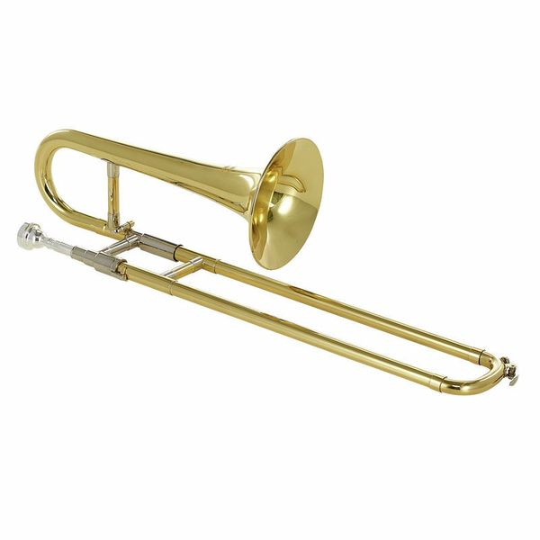

## Trombone
Le trombone c'est un jolie instrument comme ça. 

.
---
### Une fois n'est pas coutume
Le trombone c'est rigolo, c'est pas sexy comme le sax ou digne d'admiration comme la trompette. 
C'est goofy et ça fait du bruit. 

Mon exepertise reste encore limité car j'ai commencé cette année mais voici mes meilleurs conseils. 

### Le trombone en fanfare
La fanfare, c'est pour moi le meilleur moyen de  commencer un intrument. Evidement, ça ne marche malheureusement pas pour tous les instruments (à quand la fanfare avec un piano, un violon et une guitare). On peut se tromper,, il suffit de savoir faire des roulades. 
Les musiques sont relativement simple. 

### Comment s'entrainter
#### Comment organiser une repet perso
Peros, je commence par jouer la gamme du do grave jusqu'au do aigüe (2 octaves)

### Vive les petits numéros
Sur Musescore, on peut ajouter un plugin pour avoir le numéro des positions, c'est très pratique pour ceux qui débute la musique

#### Comment s'entrainter en pratique
Au début c'est compliqué, tu fais des gros pouet moche super fort, t'as super honte tu sais pas ou te mettre quand t'es en publique. 
Mais pour progresser, je pense que c'est vraiment bien de s'entrainer seul. 
Acheter une sourdine c'est pratique et même une sourdine premier prix fait l'afffaire (par contre  la technique de la chaussette pour boucher le pavillon reste inefficace de part mon experience)
Ensuite, un parc ça marche bien si vous êtes trop entourés et que vous  avez pitié de vos voisins. 

### Les differents skills

#### les notes aigüs
Au début c'est chaud, c'est frustrant/ 
De plus, il y a une difference entre atteindre une note aigüe apres être echauffé mais pas fatigué en s'entrainant et atteindre cette même note  à n'importe quel moment au milieu d'un solo devant un attroupement de passant à impressioner. 
Pour commencer, on peut essayer de jouer les morceaux à l'octave, mais bon, rien de plus satisfaisant d'arriver à jouer un passage bien aigüe (oui je sais c'aurais surement du faire de la trompette mais je ne suis pas assez aigri pour ça)

#### retenir les morceaux
Une fanfare stylé c'est une fanfare sans partition, le problème c'est que ça nécessite de savoir retenir un morceau ce qui n'est pas une mince affaire. 
Il y a une différence entre retenir une melodie, et retenir la structure d'un morceau.

Mon apprentissage sur les morceaux : 

