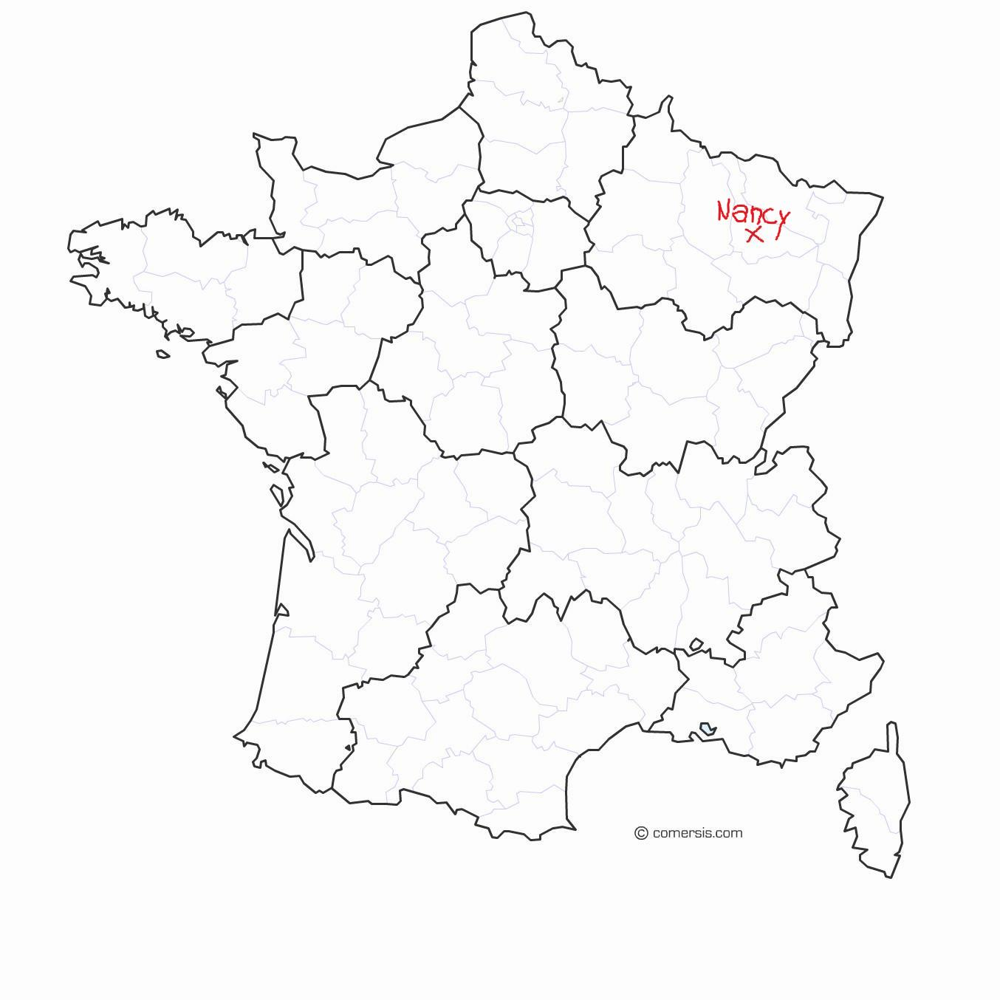

# Nancy 

Nancy c'est ici 

Concretement je vais surtout comparer avec Reims parce que je connais bien et c'est une ville de taille similaire dans une région similaire
## Un peu d'histoire

Euh, les allemands  on dû y passer un peu
Y a pas mal d'art nouveau (comme à Reims mais genre plus parce que je pense que ça a été encore plus tout cassé)
La marqueterie c'est très stylé. 

## Les infos de géographie dont la plupart des gense se tappe mais moi j'aime bien c'est rigolo
### démogrpahie
Y a bcp plus de jeunes, genre la fête de la musique on s'en rend vrmt compte. 
### repartition des richesses

## a visiter
### beaux arts de nancy 
### villa majorel
### musée de l'école de Nancy 

## les facilités ;
### Les parcs 
Richard Pouille est bien si vous passez à Vandoeuvre
Pépinirère la base, bcp d'animations en été
Parc du charmois : très tranquille, des terrains pour les boulistes -> prendre la photo avec mes deux statues préférés
Faudrait que j'aille en visité d'autres

### les bars
Vertigo : j'ai kiffé la pina colada + clim a fond et jolie piste de danse
Chez mémé (en vrai c'est mamie branché mais j'avais plus le nom) : le mojito decevant mais de la bonne musique
Court-circuit : coopérative très sympa

### les fanfares 
La fanfarone : fanfare de la mjc de lillebone (lieu sympa d'ailleurs)
Fanfare des enfants du boucher : a voir

#### danser
Une bonne communauté de danse de couple (surtout SBK latino)
Faut trouver des events et faire du contact mais sympa

